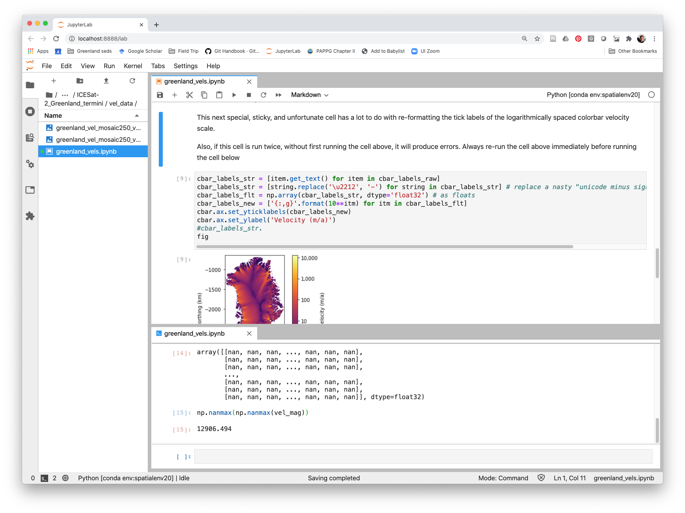

This page contains helpful tips for working with software, especially the python programming language.

A table of contents for this page includes:
+ [Python](https://tbartholomaus.github.io/uiglaciology/3-code#python)
  + [How to get started on your personal computer with python, Anaconda, and environments](https://tbartholomaus.github.io/uiglaciology/3-code#how-to-get-started-on-your-personal-computer-with-python-anaconda-and-environments)
  + [Environments: internally consistent sets of python modules](https://tbartholomaus.github.io/uiglaciology/3-code#environments-internally-consistent-sets-of-python-modules)
  + [Preferred python interface](https://tbartholomaus.github.io/uiglaciology/3-code#preferred-python-interface)
  + [Keeping a script running overnight (or other long periods)](https://tbartholomaus.github.io/uiglaciology/3-code#keeping-a-script-running-overnight-or-other-long-periods)
+ [Geographic information systems (GIS)](https://tbartholomaus.github.io/uiglaciology/3-code#geographic-information-systems-gis)

# Python
<br/>

## How to get started on your personal computer with python, Anaconda, and environments
Here are four steps you can follow to start working with python:
1. _Download and install the [Anaconda individual edition](https://docs.anaconda.com/anaconda/install/)_<br/>
    - Anaconda/conda both installs python and creates a system by which you can expand python's functionality through "packages" or "modules." You can [learn more about managing and installing packages here](https://docs.conda.io/projects/conda/en/latest/user-guide/tasks/manage-pkgs.html#).<br/>
    - If you're given the option, you'll likely want a 64 bit version (as compared to a 32 bit version). If given the option, use python 3, not python 2. python 2 is obsolete. Tim doesn't have any experience with PyCharm, and so hasn't chosen to install it himself.<br/>
    - **Before you proceed,** review the [Getting Started with Conda website](https://docs.conda.io/projects/conda/en/latest/user-guide/getting-started.html).<br/>
  

2. _Set up your conda environments_<br/>
    - This step is technically optional, but recommended before you dive into new projects.  It is necessary if you plan to work with Jupyter Lab.<br/>
    - Scientific computing with python is done using "packages" or "modules."  Some combinations of modules might be incompatible.  Anaconda helps maintain mutually consistent modules, but environments take this a step further.  By creating separate "environments," you create different virtual _workshops_ or _sandboxes_ in which all the tools are designed to work well together, and not conflict.<br/>
    - Some of the environments that the UI Glacier Dynamics Lab (and Tim personally) uses for his projects are hosted on github [here](https://github.com/tbartholomaus/conda_envs).<br/>
    - You can also [learn more about conda environments below](https://github.com/tbartholomaus/uiglaciology/blob/master/content/3-code.md#environments-internally-consistent-sets-of-python-modules).<br/>

3. _Start coding_<br/>
    - Open either Spyder or Jupyter Lab to start an interface for coding pythong. [More on these two options below](https://github.com/tbartholomaus/uiglaciology/blob/master/content/3-code.md#preferred-python-interface). If you're just getting started, Tim recommends Jupyter Lab.<br/>

4. _Learning python_<br/>
    - If you're new to programming and want to get started learning the python that's necessary for foundational work in the geosciences, Tim recommends starting with the course [Geo-Python](https://geo-python.github.io) from the University of Helsinki.  The syllabus is excellent, there are videos with instructions, clear text descriptions, and exercises to practice what you're learning. The [Earth Analytics Bootcamp course](https://www.earthdatascience.org/courses/earth-analytics-bootcamp/) from the CU Boulder Earth Lab also is excellent and has an associated online textbook for the course.<br/>
    - Tim has also had students successfully teach themselves python through various online education platforms such as EdX, Coursera, Udemy, and Educative.  Two courses that especially look good, and are targeted towards scientists (as compared to web developers) are [here at Educative](https://www.educative.io/courses/python-for-scientists-and-engineers) and [here at Udemy](https://www.udemy.com/course/python-for-data-science-and-machine-learning-bootcamp).  These courses don't tend to be free (like Geo-Python and Earth Analytics Bootcamp above), but the structure and assignments might work well for some learners. The [python website](https://wiki.python.org/moin/BeginnersGuide) also provides useful tutorials that are helpful for beginners. <br/>
    - Tim's favorite go-to reference manual, with exhaustive examples and suggestions for coding if you're not sure where to start are the [SciPy lectures](https://scipy-lectures.org/). This manual provides a consistent primer for what's involved in python's core functionality and the modules you'll need to do science, but is more like reading a textbook than taking a classs.  You can use the website itself or download the entire lecture set as a 600+ page PDF and scroll through it (Tim's preferred method).  To get going, read and work through Chap 1 ("Python scientific computing ecosystem"), Chap 2 ("The Python language" sections "First Steps," "Basic types," and "Control Flow"), and then all of Chap 4 ("NumPy") and Chap 5 ("Matplotlib"). Don't just skim these sections, but actually have Jupyter Lab or Spyder open and execute the code, experimenting along the way.<br/>
    - Once you are past the basics, googling for answers is essential.  Stack Overflow and Stackexchange are invaluable tools for professional, beginner, and enthusiastic programmers. Both are question and answer platforms used across the programming community to solve coding problems collaboratively.	 They will frequently come up in Google searches.<br/>
    - For learning more advanced topics, such as solving PDEs and matrices, symbolic computing, etc., Tim has had a great experience with the book [Numerical Python by Robert Johansson](https://www.apress.com/us/book/9781484242452).<br/>


## Environments: internally consistent sets of python modules
If you want to use python on kennicott, after you log in, type `conda activate` followed by the name of the environment you'd like to work in.  You might want to append this to the end of your `~/.bashrc` or `~/.bashprofile` file, which is a text file that runs automatically every time you log into kennicott. Different sets of packages for different purposes are organized into specific "environments," which are kept internally consistent.  You can identify the available environments by typing `conda env list`.  In fall 2020, there are four main environments that are available to all users on kennicott: base20 (fundamental, basic scientific computing packages), seisenv20 (for the purpose of working with obspy and seismic data), spatialenv20 (for the purpose of working with spatial data, like shapefiles, geotiffs, and other rasters), and imgenv20 (for image processing with opencv, PIL, etc.).  Each of these environments is maintained [on github as well, here,](https://github.com/tbartholomaus/conda_envs) so you can suggest changes, or download them yourself to have consistent environments on personal and work computers. You can change to one of these environments by typing `conda activate myenv`, in which case you replace `myenv` with the name of the environment you want to use. If there are python modules you'd like to use that don't fall in one of these categories, you can [create your own environment](https://docs.conda.io/projects/conda/en/latest/user-guide/tasks/manage-environments.html#creating-an-environment-with-commands), or [clone an existing environment](https://docs.conda.io/projects/conda/en/latest/user-guide/tasks/manage-environments.html#cloning-an-environment) and then modify it for your purposes.

## Preferred python interface
Our lab uses two different Integrated Development Environments (IDEs) or front-ends for interacting with python, and writing, running, debugging, and plotting tasks.

These two front ends are:

|**Spyder**|**Jupyter Lab**|
| -- | -- |
| You can open this program by typing `spyder` at the terminal or Anaconda Prompt window. | Jupyter Lab runs in a web browser window and you can open it by typing `jupyter lab` at the terminal or Anaconda Prompt.|
| Spyder is generally a little better for writing complete, autonomous scripts, and writing out more complicated computing workflows. Spyder is very similar to the Matlab user interface. | Jupyter Lab is potentially more useful for data exploration, and it allows text and figures to be stored right with the code. If you're just getting started, _Tim recommends trying Jupyter Lab._ |
| A traditional IDE, used by developers to write functions and scripts. | Rapidly growing development environment, on the ascendency for data scientists, with expanding popularity and functionality. |
| Used to write .py files, although py files can work with Jupyter. | Used to write .ipynb files, although these files can be exported as py files. |
| Produces python code that is potentially more portable, and easier to share with python beginners. | Produces python code with more formatting, bells and whistles, and self-contained because of embedded figures and text. |
|  |  |


## Keeping a script running overnight (or other long periods)

You might try and take advantage of kennicott's resources to run a script overnight, or for some other long period of time, then have the script write the output to some other kind of file, like text, csv, pickle, or npz.  If logged into kennicott via ssh, sometimes, if the connection isn't "active" in some way, you'll get booted off of kennicott.  And when you get booted off kennicott, the process (aka, application or script) that you're running and controlling via the ssh connection will be "killed" when you apparently "hang up" the connection on kennicott.  In that case, any work stored in memory is lost.

To get around the problem of hanging up on a process, 1) run the script directly from the terminal (rather than spyder), and 2) [use the `nohup` bash command](https://linux.101hacks.com/unix/nohup-command/) within the linux terminal window, to keep the script running in case of hangup, and 3) keep a close eye on the processes that you're running.  One example of this is a script Tim wrote to process seismic data.  See the [github README.md file](https://github.com/tbartholomaus/med_spec) for more information on this application, and the referenced python scripts for examples of how this works.  

1) To execute a script from the terminal, rather than within spyder, you'll have to [let the computer know how to read the script](https://stackoverflow.com/questions/27494758/how-do-i-make-a-python-script-executable) by adding specific header information to the top of the script you want to run, such as 
   ```
   #!/opt/anaconda/envs/seisenv/bin python
   # -*- coding: utf-8 -*-
   ```
   In the above, case, the first line, known as a "shebang" indicates what specific conda environment the script should be run from.

2) An example of using nohup is
   ```
   nohup python -u ./my_py_script.py > File_to_collect_output.log &  
   ```
   which will allow the `my_py_script.py` to run on kennicott and prevent the server from killing the process if the server becomes disconnected.  The `-u` flag forces the text output of the python script to stdout (i.e., 'standard out', which is typically to a computer monitor), so that it can then be redirected (with `>`) to a plain text log file (`File_to_collect_output.log` -- the `log` extension is arbitrary, and could be anything).  Ending the line with an `&` moves the running command (aka, 'a process') into the background, so that the terminal window can still be controlled.

3) When you begin a command in the background, with `&`, at the terminal just below your command, you'll see a 4 to 6 digit number.  This number is the PID number, and is the number that the computer uses to track and identify the process you just launched.  If you're moving commands/processes into the background, you should be aware that some of these processes can become forgotten, zombie processes, that tie up computer resources and never actually quit or finishe running.  If you start using nohup, it's your responsibility to keep an eye on the system resources you're using.  You can view all the processes you're responsible for by typing at the linux terminal: `ps -x`.  This will show a list of processes attributed to you, their PID numbers, and the commands that generated these processes.  To terminate a process and free up computer resources, use the command `kill`.  For example, to end processes 2502 and 2507, type `kill 2502 2507`.  `top` is another useful command that dynamically updates to show you all the processes that are running, who owns them, and what computer resources they're consuming.  Another way to use ps is `ps -eo pid,etime,comm`, that puts some focus on the elapsed time of each process.


# Geographic information systems (GIS)
[QGIS](https://www.qgis.org/en/site/) is a great tool for working with spatial data, like rasters and shapefiles.  It's free and has a lot of capability to view, manipulate, and explore spatial data. It is also the foundation for the packages [QGreenland](https://qgreenland.org/) and [Quantarctica](https://www.npolar.no/en/quantarctica/).  You can work with QGIS through two approaches:
1. Download and install QGIS on your laptop or lab desktop, as appopriate, or,
2. Run QGIS on our server, kennicott.  Kennicott currently has version 3.20.3 - Odense - installed. To run it, you will need to:
   - Log into the server.  We recommend using vnc/remote desktop.
   - SSH with the -Y flag **after you are logged into the server**: `ssh -Y USERNAME@kennicott.ibest.uidaho.edu`. This step seems redundant, but is necessary.
   - Open QGIS with Singularity: `singularity run --bind /data:/data /data/singularity/qgis.focal.sif`; 
   - step 4 - Profit.

   For QGIS on kennicott, some plugins are already installed (e.g. [Profile Tool](https://github.com/PANOimagen/profiletool), [QProf](https://github.com/mauroalberti/qProf), [QuickMapServices](https://github.com/nextgis/quickmapservices), [QChainage](https://github.com/mach0/qchainage)). Unfortunately, Licensed plugins such as [LAStools](https://github.com/rapidlasso/LAStoolsPluginQGIS3) will not work, and [Wine](https://www.winehq.org/) is not installed on the server.

   Note that, while the software runs smoothly when SSHing from the university network, it will be a bit laggy when accessing remotely via a VPN.
   
The University of Idaho also has licenses to ESRI products, such as ArcGIS Pro, that are available.
